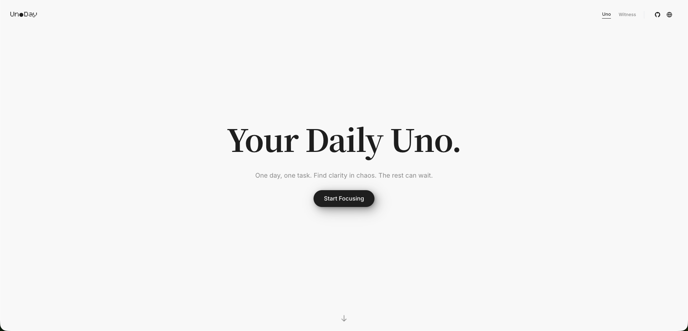
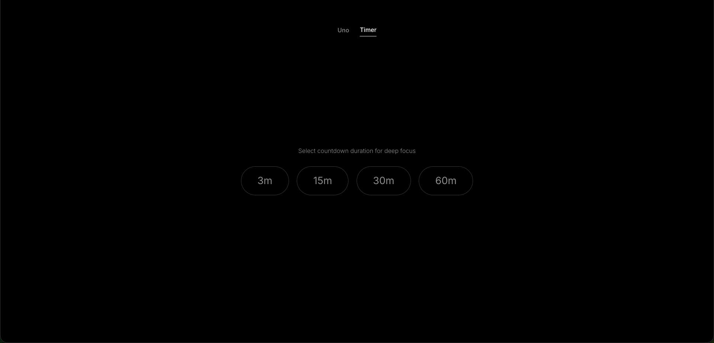
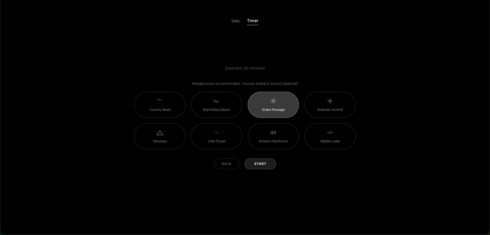

<p align="center">
  <a href="./README.md"></a>
  <a href="./README.en.md"></a>
</p>


<div align="center">
  <h1>UnoDay</h1>
  <p>Your Daily Uno.</p>
  <p>One day, one task. Stay present in the chaos. The rest can wait.</p>
</div>


## Product Philosophy
In an era where attention is "stolen," we urgently need to return to the present moment, to think about what truly matters, and to stay focused. That's Uno, a small product to help you return to focus. You can have just one Uno per day, or three to five—it's entirely up to your personal preference. The design philosophy is also rooted in Zen: "Only Now." and "Let go." When you focus on one thing, many other "thoughts" may arise. Accept them, let them go, and return to the present. It's that simple.
Additionally, the product makes significant trade-offs—there are no AI elements, except for Vibe Coding itself.

## About Uno
The word "Uno" originally derives from the Latin word "Unus," which later evolved through Spanish, Italian, and other languages, representing the number "1" (One), uniqueness, and sharing roots with "Unit" and "Unique." While building this product through Vibe Coding, I discovered there's a card game called "UNO"—when you're down to your last card, probability-wise, your winning chances are highest, but... not necessarily? Personally, I prefer pronouncing this word as (/juː/) rather than (/u/).



<p align="center">Uno Task</p>


<p align="center">Uno Focus Moment</p>




## Features
- Limited daily Unos, with Input/Thinking mode, Uno mode, and Timer mode
- Timer (3/15/30/60 minutes), choose your favorite ambient sound for deep focus
- Distraction Drawer with `Ctrl/Cmd + D` shortcut, a lightweight place to capture various distractions
- Fullscreen shortcut `F` or `Cmd/Ctrl + Shift + F` (cross-platform)
- Daily Witness & Badges (3/7/30/365)
- Local storage data, no server dependency


## Configure Maximum Daily Uno Limit
```bash
export const DAILY_UNO_LIMIT = 5;   // Every day, the maximum number of Uno
```

## Quick Start
```bash
npm install
npm run dev
```
Development server: `http://localhost:3000`

Production deployment:
```bash
npm run build
npm start
```

## Shortcuts
- `Ctrl/Cmd + D`: Toggle the distraction drawer
- `F` or `Cmd/Ctrl + Shift + F`: Enter/exit fullscreen

## Project Structure
```
Next/
├── app/                 # Layout, pages, global styles
├── components/          # Components (Header/FocusMode/Sections)
├── lib/                 # Constants, types, utils, i18n
└── hooks/               # Custom hooks (optional)
```

## License
MIT
